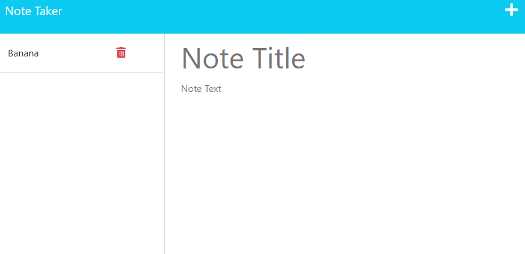

# NoteTaker
This is an application that is uses to keep teack of notes. The user can put a note into the webpage and save it for later. The user also has the option to delete the note if they no longer need it.

## Instalation
This app runs in the web browser. Any web browser will work for this application.

## Technology used
This application uses Node.js, Javascript, CSS, HTML, and handlebars. 

## Image

## Deployed Application

https://nodenotetaker.herokuapp.com/notes

## Contributors
This is a public repository, if you want to add to the code please feel free to.
- Evan Sterling Miller

## License
This project is licensed under the MIT License.

